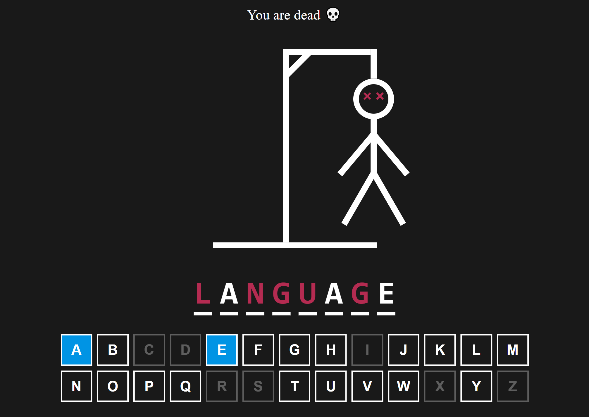

# Hangman Game

In this project, I used `React`  and `Typescript`  to create a Hangman game.

## Live Demo

You can try the game yourself at:
https://ysyassine.github.io/hangman/

## How to play

This game is pretty simple and straight forward. All you have to do is to guess a word by suggesting letters within 6 guesses otherwise you are done💀.

No worries as you can simply press the `Enter` key to start a new round with a new word.

Have fun 😀
